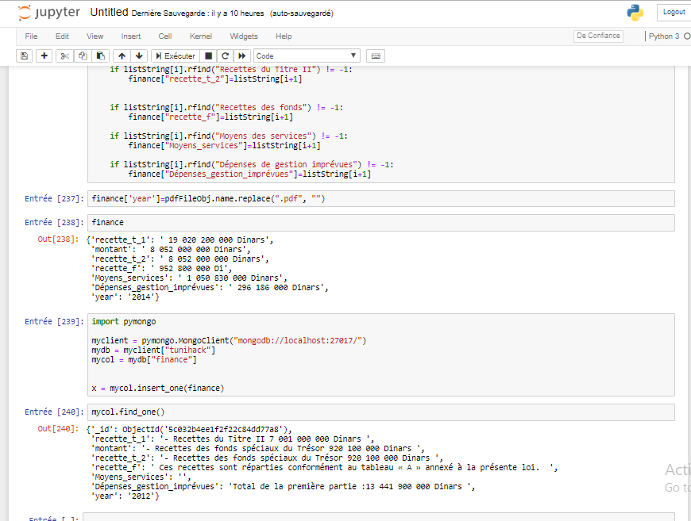
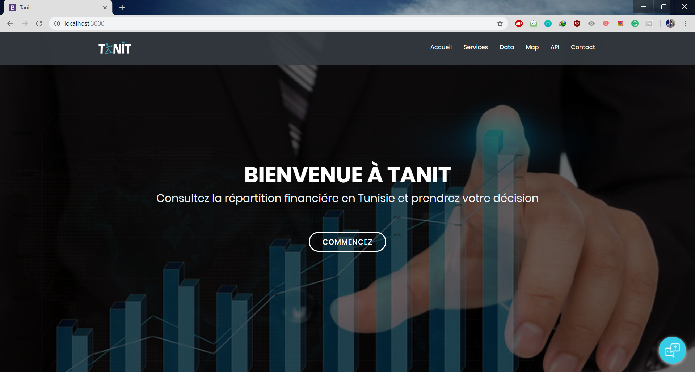
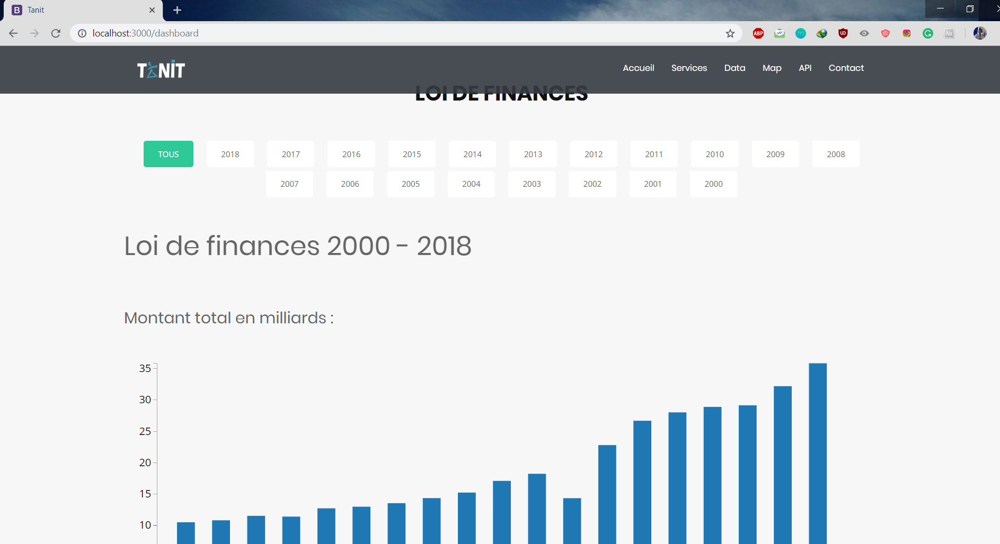
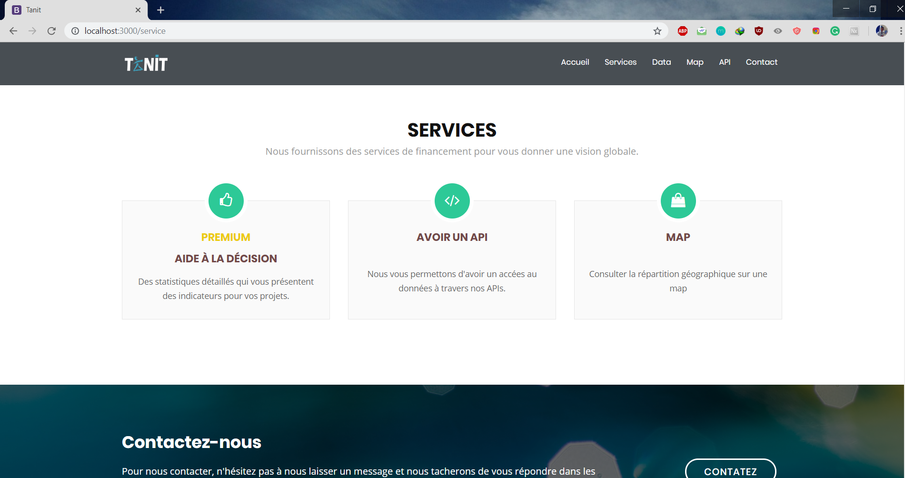
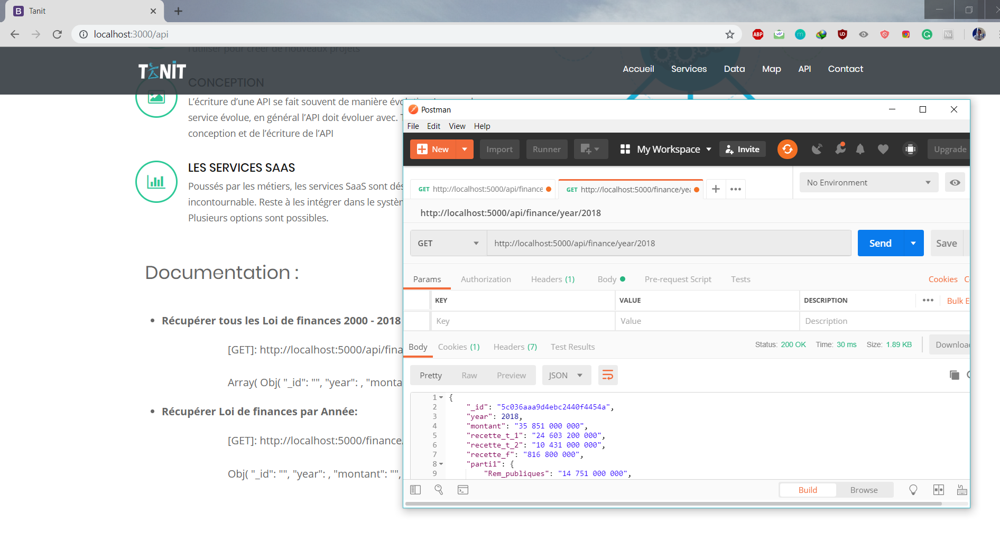

#How to Run the App :

> cd Tunihack2018

> npm install

>cd Tunihack2018/client

>npm install

>cd Tunihack2018/chatbot

>npm install

#Start server + client :

> npm run start-dev

#Screenshots:

